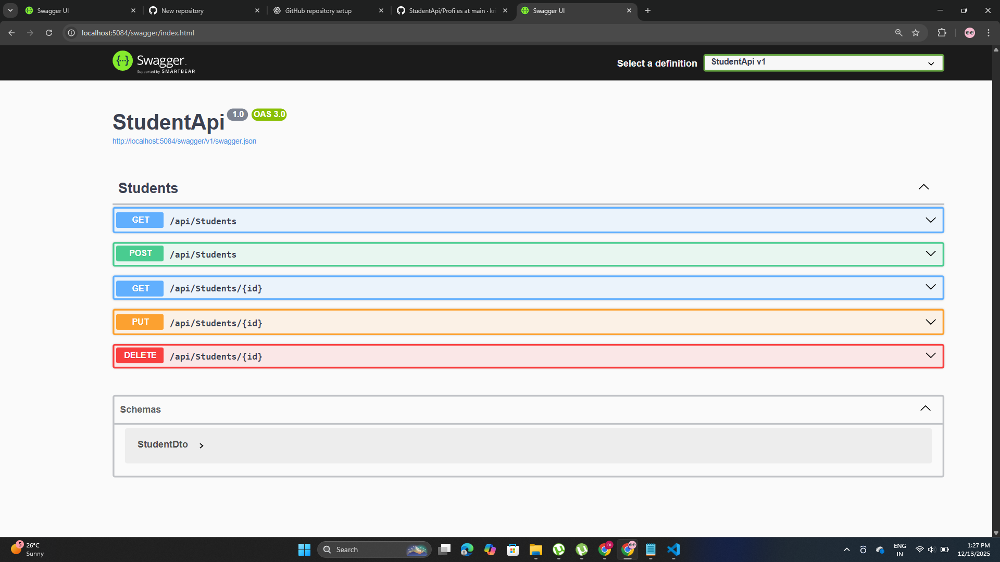
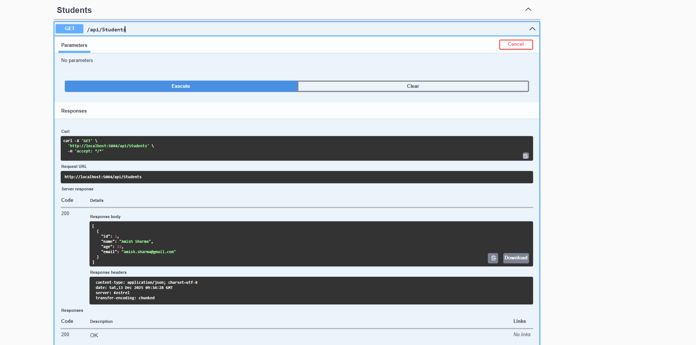

# StudentApi – Quick README

## ▶ Run
1. `dotnet build`
2. `dotnet run`
3. Open **Swagger** (URL shown in console)  
   or open `/test.html` for JavaScript demo.

---

## 🛠 Tech
- .NET 10 Web API, C#
- Entity Framework Core (SQLite)
- Repository Pattern, Service Layer
- AutoMapper
- FluentValidation
- Swagger (OpenAPI)

---

## 📷 Swagger Screenshots

### Swagger Interface

### POST – Create Student

### GET – All Students

### GET – Student by ID

### PUT – Update Student

### DELETE – Delete Student

---

## ✅ Status
- CRUD operations tested via Swagger
- Database: SQLite
- Project ready for GitHub & interviews

